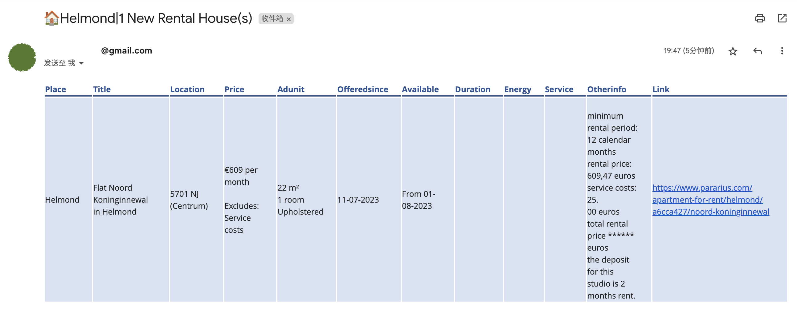

# Rental Monitor

This repository contains a rental monitor script that allows you to track and receive email notifications for new rental properties in specific locations. It supports popular rental websites such as Pararius and Funda.

 

## Features

- Supports multiple rental websites: Pararius and Funda.
- Configurable search parameters: Specify the locations and maximum price for the rentals.
- Historical data management: Keeps track of previously seen rental properties to avoid duplicates.
- Email notification: Sends an email with a summary of new rental properties.

## Installation

1. Clone the repository:

   ```shell
   git clone https://github.com/your-username/rental-monitor.git
   ```

2. Install the required dependencies:

   ```shell
   pip install -r requirements.txt
   ```

## Configuration

1. Open the `main.py` file and configure the search parameters and URLs:

   ```python
   places = [
       "helmond",
       "eindhoven",
       "veldhoven"
   ]
   max_price = 1300
   ```

   Adjust the `places` list to include the desired locations. Set the `max_price` variable to the maximum rental price.

2. Set up the necessary environment variables:

   - `RENT_HISTORY`: [Sheety](https://sheety.co/) google sheet API.
   - `RENT_KEY`: The authorization key for accessing Sheety google sheet.
   - `GMAIL`: Your Gmail email address.
   - `PASSWORD`: The password for your Gmail account.

   **Note:** Make sure to keep the environment variables secure and do not commit them to version control.

## Usage

Run the script using the following command:

```shell
python main.py
```

The rental monitor will search for new rental properties based on the configured parameters. If new properties are found, an email notification will be sent to your Gmail address.

🤞 Good luck and have fun!
